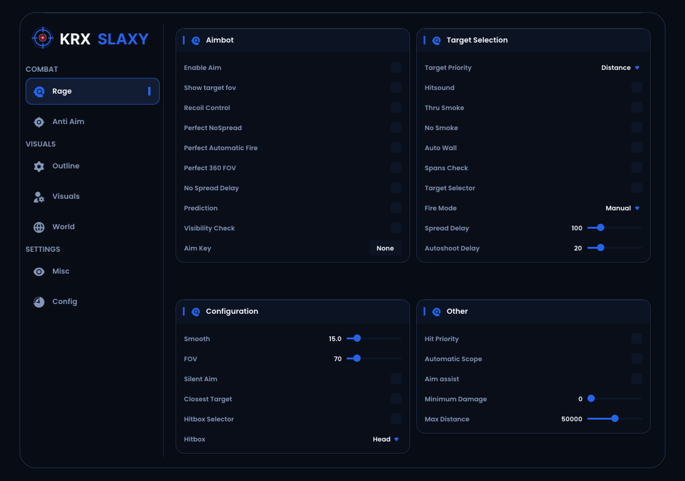

# KRX SLAXY - Dear ImGui DirectX 11 Frontend Template

A lightweight, modern, standalone GUI frontend template built with **C++20**, **DirectX 11**, and **Dear ImGui**.

## Features

- **DirectX 11 Backend:** Native rendering pipeline with clean swap chain presentation.
- **Dear ImGui (v1.89+):** Customized dark-blue aesthetics, glowing borders, and rounded card panels.
- **FreeType Font Integration:** Crisp typography and glyph rendering.
- **Smooth Easing Animations:** Exponential decay toggle animation with centered bloom and vertical glide (INSERT key).
- **Dual Backdrop Support:** Toggleable white / dark canvas backdrop (F1 key).
- **Pure Frontend Architecture:** Completely decoupled UI template with zero backend hooks or game memory dependencies.
- **Zero Comment Source:** Pure, clean code ready for custom integration.

## Controls

- **[INSERT]:** Toggle menu visibility with smooth easing transition.
- **[F1]:** Toggle window backdrop (Pure White / Deep Navy).

## Building from Source

### Prerequisites
- Windows 10/11 (x64)
- Visual Studio 2022 (with *Desktop development with C++* workload)
- Windows 10/11 SDK

### Build Steps
1. Clone the repository:
   `ash
   git clone https://github.com/<your-username>/krxslaxy.git
   cd krxslaxy
   `
2. Open krxslaxy.sln in Visual Studio 2022.
3. Select **Release** and **x64** configuration.
4. Press **Build Solution** (Ctrl+Shift+B).
5. Output executable will be generated at in/Release/krxslaxy.exe.

## License
This project is licensed under the MIT License - see the [LICENSE.txt](LICENSE.txt) file for details.
